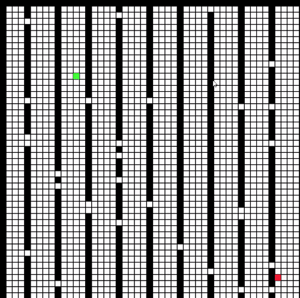

# Path Finding Visualizer in Python using Pygame and TKinter

A python visualization of some well known path finding algorithms. It allows you to pick your start and end location, algorithm, heuristics, weights and obstacle layout and then lets you view the process of finding the shortest path.

## Algorithms

 * A* Search
 * Dijkstra's Algorithm
 * Breadth First Search
 * Depth First Search

## Features

* User can select algorithm (A*, Dijkstra, DFS, BFS)
* User can select initial layout (Blank, Random, Fixed Maze)
* User can select weights (All Weights 1, Random Weights, Fixed Weights)
* For A* user can select Heuristic (Euclidean, Manhattan, Diagonal)

## Requirements
- Python 3.x
- Pip
- TKinter
- Pygame

## Run in Local Machine

Download or clone the repository. Go to the download directory and open console. 

Run:

> python path_finding.py

If required packages are not installed user will get a prompt to install. Proceed with the instructions.

Enter start and end co-ordinates (comma separated integers). After setting all the options press `Submit`.

Use `cursor` to draw walls and press `SPACE` button to start visualization.

## Run in Gitpod

You can also run the program in Gitpod, a free online dev environment for GitHub:

Requires a Gitpod account to use.

In Gitpod workspace proceed as stated in `Run in Local Machine`.

*Please Note*: After installing pygame in workspace run 

> python3 path_finding.py

*Another Note*: The GUI is a little glithcy in GitPod. For best results expand the VNC window to be full screen.

## Demo

## Reference

[https://github.com/techwithtim/A-Path-Finding-Visualization](https://github.com/techwithtim/A-Path-Finding-Visualization)

